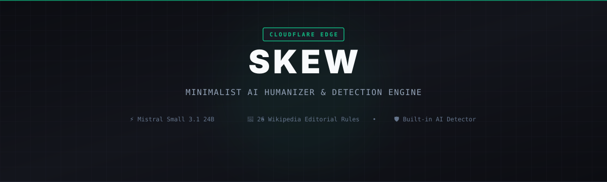

<div align="center">
  
  <p align="center">
    <strong>Minimalist, Privacy-First AI Text Humanizer &amp; Detection Engine on Cloudflare Workers</strong>
  </p>
  <p align="center">
    
    
    
    
    
  </p>
</div>

---

## Panoramica

**Skew** è un motore di riscrittura, umanizzazione e rilevamento testuale open source, progettato per girare interamente all'Edge su **Cloudflare Workers**. 

Sfrutta il modello **Mistral Small 3.1 24B** (`@cf/mistralai/mistral-small-3.1-24b-instruct`) via GPU edge di Cloudflare Workers AI per ottenere un italiano autentico, privo di anglicismi artificiali e ricco di naturalezza stilistica, combinandolo con un **motore locale euristico deterministico** e un **rilevatore di umanità integrato** con analisi frase per frase.

---

## Caratteristiche Principali

- ⚡ **Cloudflare Workers AI Nativo (Default: Mistral Small 3.1 24B)**:
  - Esecuzione GPU a bassa latenza su rete Edge globale.
  - Oltre a Mistral Small, supporta Meta Llama 3.3 70B Fast, Llama 4 Scout 17B e Qwen 2.5 Coder 32B.
- 📖 **26 Standard Editoriali di Wikipedia / Blader**:
  - Rimuove sistematicamente i 26 segnali rivelatori dei chatbot: gerundi di coda (*shallow -ing riders*), importanza gonfiata, connettivi meccanici (*"inoltre"*, *"in conclusione"*), false simmetrie (*"non solo X ma Y"*) e triadi forzate.
- 🎯 **Bando al Copywriting da Brochure SaaS & Schema "Feature $\rightarrow$ Beneficio Generico"**:
  - Smonta le collocazioni vuote da marketing (*"fondersi perfettamente"*, *"architettura snella"*, *"reattività istantanea"*, *"con un semplice clic"*) e ripristina la precisione tecnica ingegneristica (*"mantiene allineato lo stato dell'applicazione"*).
- 🛡️ **AI Detector Integrato & Heatmap Frase per Frase**:
  - Scansiona in tempo reale Burstiness (Coeff. di Variazione della lunghezza dei periodi), Diversità Lessicale (TTR) e densità di cliché.
  - Heatmap visuale interattiva: 🟩 Verde (Umano), 🟨 Giallo (Misto / Dubbio), 🟥 Rosso (Firma IA evidente).
- 🔒 **Motore Locale Heuristic Offline (Zero Modelli / Zero Costi Token)**:
  - Funziona offline a latenza zero tramite regole NLP deterministiche, de-nominalizzazioni e bilanciamento attivo della cadenza.
- 🧩 **Zero Dipendenze Runtime Esterne**:
  - Compilato in un singolo Worker autosufficiente con dashboard scura in stile monospace (`wrangler dev` / `wrangler deploy`).

---

## Architettura del Sistema

```
                      ┌────────────────────────────────────────┐
                      │            Source Text Input           │
                      └──────────────────┬─────────────────────┘
                                         │
                   ┌─────────────────────┴─────────────────────┐
                   ▼                                           ▼
       ┌───────────────────────┐                   ┌───────────────────────┐
       │  Cloudflare Workers AI │                   │ Local Heuristic Engine │
       │   (Mistral Small 3.1) │                   │  (Deterministic NLP)  │
       └───────────┬───────────┘                   └───────────┬───────────┘
                   │                                           │
                   └─────────────────────┬─────────────────────┘
                                         ▼
                      ┌────────────────────────────────────────┐
                      │    Deterministic Output Sanitizer      │
                      │  (Strips chatter & stubborn clichés)   │
                      └──────────────────┬─────────────────────┘
                                         ▼
                      ┌────────────────────────────────────────┐
                      │  AI Detector & Sentence Heatmap Audit  │
                      └──────────────────┬─────────────────────┘
                                         ▼
                      ┌────────────────────────────────────────┐
                      │     Clean, Humanized & Scored Text     │
                      └────────────────────────────────────────┘
```

---

## Configurazione & Credenziali

Configura le variabili d'ambiente nel file `.dev.vars` (per sviluppo locale) o nel cruscotto di Cloudflare Workers:

```env
CLOUDFLARE_ACCOUNT_ID=5409693716803be3df6614f05165ccdb
CLOUDFLARE_API_TOKEN=il_tuo_token_workers_ai
CLOUDFLARE_MODEL=@cf/mistralai/mistral-small-3.1-24b-instruct
```

> **Nota**: È possibile salvare provider e chiavi API alternative (Groq, OpenAI, Anthropic, Gemini, OpenRouter o Ollama locale) direttamente nel browser tramite il pulsante `⚙ CONFIG [F2]`.

---

## API Endpoints

### 1. `POST /api/humanize`
Riscrive e umanizza il testo rimuovendo cliché e strutture artificiali da IA.

```bash
curl -X POST https://tuo-worker.workers.dev/api/humanize \
  -H "Content-Type: application/json" \
  -d '{
    "text": "È fondamentale adottare un approccio modulare, minimizzando il debito tecnico...",
    "provider": "cf-ai",
    "model": "@cf/mistralai/mistral-small-3.1-24b-instruct",
    "mode": "natural",
    "aggression": "medium"
  }'
```

### 2. `POST /api/detect`
Verifica l'umanità del testo e genera l'audit con punteggio e heatmap per ogni frase.

```bash
curl -X POST https://tuo-worker.workers.dev/api/detect \
  -H "Content-Type: application/json" \
  -d '{
    "text": "Un modulo costruito per fondersi perfettamente nel flusso di lavoro quotidiano..."
  }'
```

---

## Sviluppo Locale & Deploy

```bash
# Installa le dipendenze
npm install

# Avvia l'ambiente di sviluppo locale con hot-reload
npm run dev

# Effettua il deploy su Cloudflare Workers
npm run deploy
```

---

## Licenza

Distribuito sotto licenza [MIT](LICENSE).
